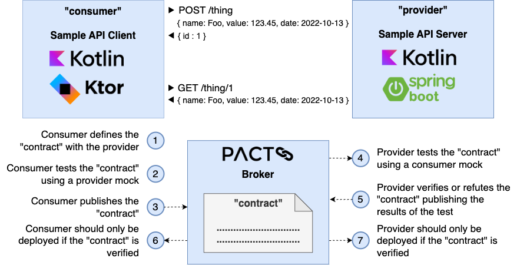
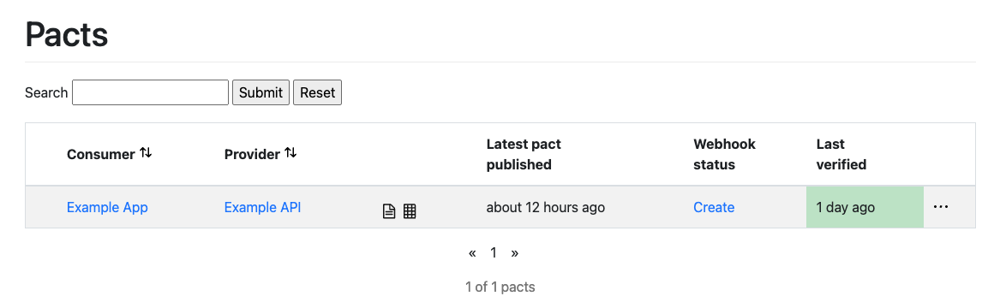
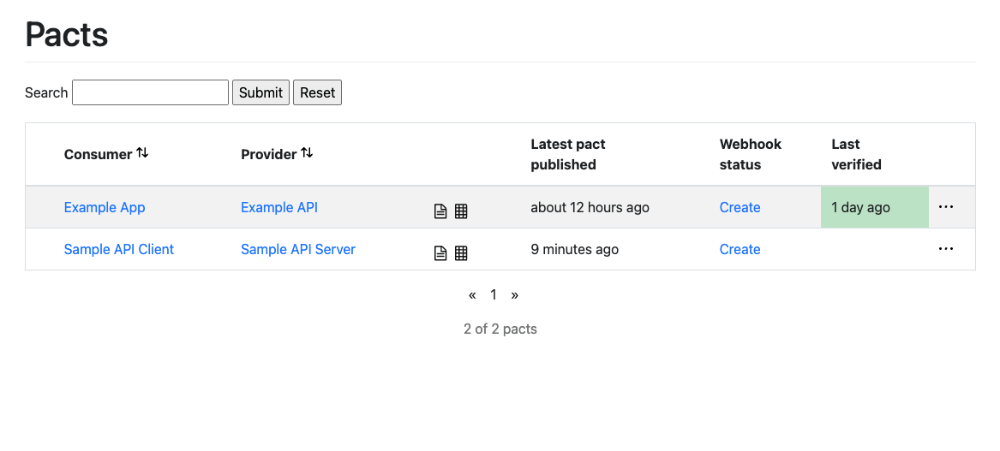
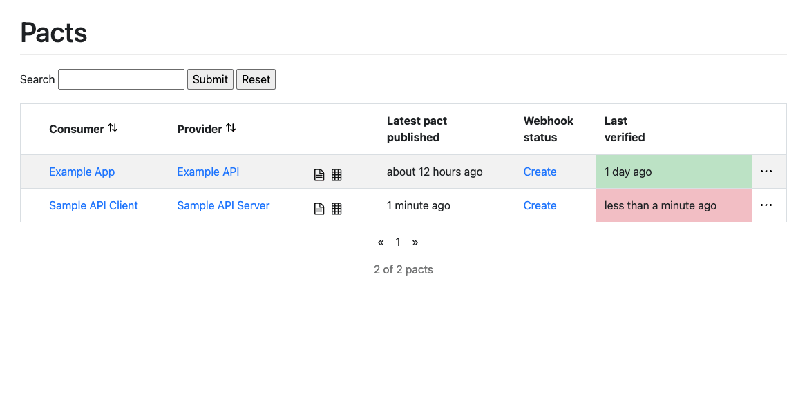
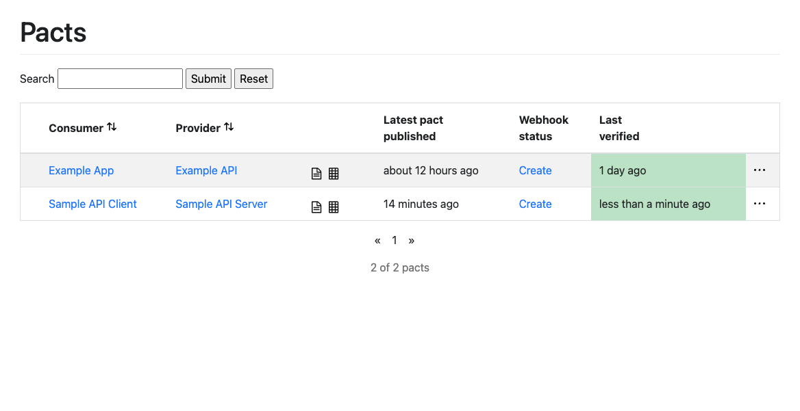

[](https://github.com/rogervinas/contract-testing-with-pact/actions/workflows/ci.yml)

# Contract Testing with Pact

This PoC shows a step by step implementation of contract testing using [Pact](https://docs.pact.io/).

First of all a couple of definitions:

> **[Contract testing](https://docs.pact.io/#what-is-contract-testing)** is a technique for testing an integration point by checking each application in isolation to ensure the messages it sends or receives conform to a shared understanding that is documented in a "contract".
> 
> **[Consumer driven contract testing](https://pactflow.io/what-is-consumer-driven-contract-testing/)** is a type of **contract testing** that ensures that a provider is compatible with the expectations that the consumer has of it. For an HTTP API (and other synchronous protocols), this would involve checking that the provider accepts the expected requests, and that it returns the expected responses. For a system that uses message queues, this would involve checking that the provider generates the expected message.

So let's try to implement this flow:



* [1) Consumer defines the "contract" with the Provider](#1-consumer-defines-the-contract-with-the-provider)
* [2) Consumer tests the "contract" using a provider mock](#2-consumer-tests-the-contract-using-a-provider-mock)
* [3) Consumer publishes the "contract"](#3-consumer-publishes-the-contract)
* [4) Provider tests the "contract" using a consumer mock](#4-provider-tests-the-contract-using-a-consumer-mock)
  * [Using @WebFluxTest](#using-webfluxtest)
  * [Using @SpringBootTest](#using-springboottest)
* [5) Provider verifies or refutes the "contract"](#5-provider-verifies-or-refutes-the-contract)
* [6+7) Deploy only when the "contract" is verified](#67-deploy-only-when-the-contract-has-been-verified)
* [Implementation Details](#implementation-details)
* [Want to know more?](#want-to-know-more)

## 1) Consumer defines the "contract" with the Provider

For the "Sample API Client" we will use [Kotlin](https://kotlinlang.org/) and [Ktor client](https://ktor.io/docs/create-client.html).

To define `POST /thing` endpoint we specify the following "pact":

```kotlin
@ExtendWith(PactConsumerTestExt::class)
@TestInstance(PER_CLASS)
class SampleApiClientContractTest {
  @Pact(provider = "Sample API Server", consumer = "Sample API Client")
  fun create(builder: PactDslWithProvider): V4Pact {
    return builder
      .given("Initial State")
      .uponReceiving("Create Thing")
      .path("/thing")
      .method("POST")
      .headers(mapOf("Content-Type" to "application/json"))
      .body(
        """
        {
          "name": "Foo",
          "value": 123.45,
          "date": "2022-10-13"
        }
        """.trimIndent()
      )
      .willRespondWith()
      .status(201)
      .headers(mapOf("Content-Type" to "application/json"))
      .body(
        """
        {
          "id": 123
        }
        """.trimIndent()
      )
      .toPact(V4Pact::class.java)
  }
}
```

As you see we can use fixed JSON expectations, but we can use also [PactDslJsonBody DSL](https://docs.pact.io/implementation_guides/jvm/consumer#building-json-bodies-with-pactdsljsonbody-dsl) which allows us to specify regex and type matchers to each field.

For example the request can be specified as:
```kotlin 
.body(PactDslJsonBody()
  .stringMatcher("name", "\\w+", "Foo")
  .decimalType("value", 123.45)
  .localDate("date", "yyyy-MM-dd", LocalDate.of(2022, 10, 13))
)
```

And the response:
```kotlin
.body(PactDslJsonBody()
  .integerType("id", 123)
)
```

To define `GET /thing/{id}` endpoint we will specify two "pacts":

* One for the case "thing exists":
```kotlin
@Pact(provider = "Sample API Server", consumer = "Sample API Client")
fun getExistingThing(builder: PactDslWithProvider): V4Pact {
return builder
  .given("Thing 123 exists")
  .uponReceiving("Get Thing 123 when it exists")
  .path("/thing/123")
  .method("GET")
  .willRespondWith()
  .status(200)
  .headers(mapOf("Content-Type" to "application/json"))
  .body(
    """
      {
        "name": "Foo",
        "value": 123.45,
        "date": "2022-10-13"
      }
      """.trimIndent()
  )
  .toPact(V4Pact::class.java)
}
```

* Another one for the case "thing does not exist":
```kotlin
@Pact(provider = "Sample API Server", consumer = "Sample API Client")
fun getNonExistingThing(builder: PactDslWithProvider): V4Pact {
return builder
  .given("Initial State")
  .uponReceiving("Get Thing 123 when it does not exist")
  .path("/thing/123")
  .method("GET")
  .willRespondWith()
  .status(404)
  .toPact(V4Pact::class.java)
}
```

## 2) Consumer tests the "contract" using a provider mock

If we want to focus on "[test first](http://www.extremeprogramming.org/rules/testfirst.html)" we need an empty implementation of the client just to make it compile:
```kotlin
data class SampleThing(
  val name: String,
  val value: Double,
  @JsonFormat(pattern = "yyyy-MM-dd") val date: LocalDate
)

data class SampleThingId(
  val id: Int
)

interface SampleApiClient {
  suspend fun create(thing: SampleThing): SampleThingId?
  suspend fun get(thingId: SampleThingId): SampleThing?
}

class SampleApiKtorClient(private val serverUrl: String) : SampleApiClient {
  
  override suspend fun create(thing: SampleThing): SampleThingId? {
    TODO("Not yet implemented")
  }

  override suspend fun get(thingId: SampleThingId): SampleThing? {
    TODO("Not yet implemented")
  }
}
```

Now we create tests for the three "pacts" defined in the previous step:

```kotlin
@Test
@PactTestFor(providerName = "Sample API Server", pactMethod = "create", providerType = SYNCH)
fun `should create thing`(mockServer: MockServer) {
  val client = SampleApiKtorClient(mockServer.getUrl())
  val thingId = runBlocking {
    client.create(SampleThing("Foo", 123.45, LocalDate.of(2022, 10, 13)))
  }
  assertThat(thingId)
    .isEqualTo(SampleThingId(123))
}

@Test
@PactTestFor(providerName = "Sample API Server", pactMethod = "getExistingThing", providerType = SYNCH)
fun `should get thing 123 when it exists`(mockServer: MockServer) {
  val client = SampleApiKtorClient(mockServer.getUrl())
  val thing = runBlocking { 
    client.get(SampleThingId(123)) 
  }
  assertThat(thing)
    .isEqualTo(SampleThing("Foo", 123.45, LocalDate.of(2022, 10, 13)))
}

@Test
@PactTestFor(providerName = "Sample API Server", pactMethod = "getNonExistingThing", providerType = SYNCH)
fun `should not get thing 123 when it does not exist`(mockServer: MockServer) {
  val client = SampleApiKtorClient(mockServer.getUrl())
  val thing = runBlocking {
    client.get(SampleThingId(123))
  }
  assertThat(thing).isNull()
}
```

Note that:
* In `@PactTestFor` annotation `pactMethod` should match the name of the method annotated with `@Pact`.
* We pass to the client the `MockServer`'s `url`.
* Just for documentation, we specify the provider as a synchronous provider (HTTP)

Once we have a final implementation of the client wrapping a [Ktor client](https://ktor.io/docs/create-client.html) ...
```kotlin
class SampleApiKtorClient(private val serverUrl: String) : SampleApiClient {

  private val client = HttpClient(CIO) {
    install(ContentNegotiation) {
      jackson {
        registerModule(JavaTimeModule())
      }
    }
  }

  override suspend fun create(thing: SampleThing): SampleThingId? {
    val response = client.post("$serverUrl/thing") {
      contentType(ContentType.Application.Json)
      setBody(thing)
    }
    return when(response.status) {
      HttpStatusCode.Created -> response.body<SampleThingId>()
      else -> null
    }
  }

  override suspend fun get(thingId: SampleThingId): SampleThing? {
    val response = client.get("$serverUrl/thing/${thingId.id}")
    return when(response.status) {
      HttpStatusCode.OK -> response.body<SampleThing>()
      else -> null
    }
  }
}
```

... if we execute tests on [SampleApiClientContractTest](sample-api-client/src/test/kotlin/com/rogervinas/sample/api/client/SampleApiClientContractTest.kt):
1. Tests will be executed against a provider mock.
2. The "contract" will be generated locally under `build/pacts`. We can generate them in another directory using `@PactDirectory` annotation or `pact.rootDir` system property.

You can check the "contract" generated locally in `build/pacts/Sample API Client-Sample API Server.json`.

## 3) Consumer publishes the "contract"

The consumer "contract" is now generated locally, but it should be published to a [PactBroker](https://docs.pact.io/pact_broker), so it can be shared with the provider.

To test it locally:

1. Start a local instance of [PactBroker](https://docs.pact.io/pact_broker) with a sqlite database:
```shell
docker compose up -d
```

2. Go to http://localhost:9292, you will see a "contract" example that comes by default:


3. Publish the consumer "contract" using `pactPublish` gradle task:
```shell
cd ./sample-api-client
./gradlew pactPublish

> Task :pactPublish
Publishing 'Sample API Client-Sample API Server.json' ... 
OK
```

4. Go back to http://localhost:9292, you will see the consumer "contract":


## 4) Provider tests the "contract" using a consumer mock

For the "Sample API Server" we will use [Kotlin](https://kotlinlang.org/) and [Spring Boot](https://spring.io/projects/spring-boot) with [WebFlux](https://docs.spring.io/spring-framework/docs/current/reference/html/web-reactive.html).

Here we have two options to test the "contract":
* Test it against **only the API layer** using a [WebFluxTest](https://docs.spring.io/spring-boot/docs/current/reference/htmlsingle/#features.testing.spring-boot-applications.spring-webflux-tests).
* Test it against **the whole Application** using a [SpringBootTest](https://docs.spring.io/spring-boot/docs/current/reference/htmlsingle/#features.testing).

### Using @WebFluxTest

We start with this:
```kotlin
@WebFluxTest(controllers = [SampleApiController::class])
@Provider("Sample API Server")
@PactFolder("../sample-api-client/build/pacts")
@ExtendWith(PactVerificationSpringProvider::class)
class SampleApiControllerContractTest {

  @Autowired
  private lateinit var webTestClient: WebTestClient

  @BeforeEach
  fun beforeEach(context: PactVerificationContext) {
    context.target = WebTestClientTarget(webTestClient)
  }

  @TestTemplate
  fun pactVerificationTestTemplate(context: PactVerificationContext) {
    context.verifyInteraction()
  }
  
  @State("Initial State")
  fun `initial state`() {
      // TODO
  }

  @State("Thing 123 exists")
  fun `thing 123 exists`() {
      // TODO
  }  
}
```
Note that:
* `@WebFluxTest` is a standard Spring Boot "slice test" where **only** components needed to test `SampleApiController` will be started.
* A `WebTestClient` is the standard way to test controllers on a `@WebFluxTest`, but in this case we will not use it directly, we will just pass it to the `PactVerificationContext`.
* Just temporarily we use `@PactFolder` annotation to  **read the "contract" from the local directory** where `sample-api-client` has generated it. No need for a [PactBroker](https://docs.pact.io/pact_broker) yet.
* We use `@Provider` annotation to specify that we are executing tests for the "Sample API Server" provider.
* We have to create as many methods annotated with `@State` as states the "contract" expects. We leave them empty for now but we will have to properly set the state there.
* Finally `PactVerificationSpringProvider` junit5 extension and `pactVerificationTestTemplate` method annotated with junit5's `@TestTemplate` will create tests dynamically following the "contract".

If we create an empty `SampleApiController` to make this test compile:
```kotlin
@RestController
class SampleApiController
```

And then we try to execute the test:
```shell
cd sample-api-server
./gradlew test

> Task :test

SampleApiControllerContractTest > Sample API Client - Create Thing - FAILED
1) Verifying a pact between Sample API Client and Sample API Server - Create Thing: has status code 201
  1.1) status: expected status of 201 but was 404
  1.2) body: $ Actual map is missing the following keys: id

SampleApiControllerContractTest > Sample API Client - Get Thing 123 when it does not exist - PASSED

SampleApiControllerContractTest > Sample API Client - Get Thing 123 when it exists - FAILED
1) Verifying a pact between Sample API Client and Sample API Server - Get Thing 123 when it exists: has status code 200
  1.1) status: expected status of 200 but was 404
  1.2) body: $ Actual map is missing the following keys: date, name, value
```

Turns out that with an empty controller we pass one of the tests 😜

Once we have a final implementation of the controller ...
```kotlin
@RestController
class SampleApiController(private val repository: SampleRepository) {

  @PostMapping("/thing", consumes = [APPLICATION_JSON_VALUE], produces = [APPLICATION_JSON_VALUE])
  @ResponseStatus(CREATED)
  suspend fun create(@RequestBody thing: SampleThing) = repository.save(thing)

  @GetMapping("/thing/{id}", produces = [APPLICATION_JSON_VALUE])
  suspend fun get(@PathVariable("id") id: Int): ResponseEntity<SampleThing> {
    return when (val thing = repository.get(SampleThingId(id))) {
      null -> ResponseEntity.notFound().build()
      else -> ResponseEntity.ok(thing)
    }
  }
}
```

... we can implement the contract test as:
```kotlin
@WebFluxTest(controllers = [SampleApiController::class])
@Provider("Sample API Server")
@PactFolder("../sample-api-client/build/pacts")
@ExtendWith(PactVerificationSpringProvider::class)
class SampleApiControllerContractTest {

  @Autowired
  private lateinit var webTestClient: WebTestClient

  @MockkBean
  private lateinit var repository: SampleRepository

  @BeforeEach
  fun beforeEach(context: PactVerificationContext) {
    context.target = WebTestClientTarget(webTestClient)
  }

  @TestTemplate
  fun pactVerificationTestTemplate(context: PactVerificationContext) {
    context.verifyInteraction()
  }

  @State("Initial State")
  fun `initial state`() {
    every { repository.save(any()) } returns SampleThingId(123)
    every { repository.get(any()) } returns null
  }

  @State("Thing 123 exists")
  fun `thing 123 exists`() {
    every {
      repository.get(SampleThingId(123))
    } returns SampleThing("Foo", 123.45, LocalDate.of(2022, 10, 13))
  }
}
```
Note that:
* We mock a `SampleRepository` because `SampleApiController` needs one.
* In the state "Initial State":
  * `SampleRepository` mock will return `null` whenever `get` is called with any `SampleThingId` because it is supposed to be empty.
  * `SampleRepository` mock will return `SampleThingId(123)` whenever `save` is called with any `SampleThing` to simulate saving it.
* In the state "Thing 123 exists":
  * `SampleRepository` mock will return `null` whenever `get` is called with `SampleThingId(123)` because is supposed to be stored there.

Now if we execute the test everything should be 🟩

Finally, in a real scenario we will use `@PactBroker` instead of `@PactFolder` in order to retrieve the "contract" from a [PactBroker](https://docs.pact.io/pact_broker):
```kotlin
@WebFluxTest(controllers = [SampleApiController::class])
@Provider("Sample API Server")
@PactBroker
@ExtendWith(PactVerificationSpringProvider::class)
class SampleApiControllerContractTest {
   // ... 
}
```
Note that:
* [PactBroker](https://docs.pact.io/pact_broker) url can be set directly on the `@PactBroker(url=xxx)` annotation or via the `pactbroker.url` system property. 

You can review the final implementation in [SampleApiControllerContractTest](sample-api-server/src/test/kotlin/com/rogervinas/sample/api/server/SampleApiControllerContractTest.kt).

### Using @SpringBootTest

We can also test the "contract" against the whole application using a [SpringBootTest](https://docs.spring.io/spring-boot/docs/current/reference/htmlsingle/#features.testing):
```kotlin
@SpringBootTest(webEnvironment = DEFINED_PORT)
@Provider("Sample API Server")
@PactBroker
@ExtendWith(PactVerificationSpringProvider::class)
class SampleApiServerContractTest {

  @TestTemplate
  fun pactVerificationTestTemplate(context: PactVerificationContext) {
    context.verifyInteraction()
  }

  @State("Initial State")
  fun `initial state`() {
    // TODO set "Initial State" state
  }

  @State("Thing 123 exists")
  fun `thing 123 exists`() {
    // TODO set "Thing 123 exists" state
  }
}
```

And a little extra code if we want to start the application using a random port:
```kotlin
@SpringBootTest(webEnvironment = RANDOM_PORT)
@Provider("Sample API Server")
@PactBroker
@ExtendWith(PactVerificationSpringProvider::class)
class SampleApiServerContractTest {

  @LocalServerPort
  private var port = 0

  @BeforeEach
  fun beforeEach(context: PactVerificationContext) {
    context.target = HttpTestTarget("localhost", port)
  }

  // ...
}
```

Finally, we only need to set the expected state using the `@State` annotated methods. How we do that will be different on each case. For example if we are using a real database that would mean to insert/delete rows from a table, etc.

Just for this PoC we can cheat a little and implement an in-mem `SampleRepository` this way with a convenient `reset` method:
```kotlin
@Repository
class SampleRepository {

  private val sampleThingIdNext = AtomicInteger(1)
  private val sampleThings = mutableMapOf<SampleThingId, SampleThing>()

  fun save(thing: SampleThing): SampleThingId {
    val thingId = SampleThingId(sampleThingIdNext.getAndIncrement())
    sampleThings[thingId] = thing
    return thingId
  }

  fun get(thingId: SampleThingId) = sampleThings[thingId]

  fun reset(nextId: Int) {
    sampleThingIdNext.set(nextId)
    sampleThings.clear()
  }
}
```

So we can implement the state methods this way:
```kotlin
@Autowired
private lateinit var repository: SampleRepository

@State("Initial State")
fun `initial state`() {
  // clear repository and set next id = 123
  repository.reset(123)
}

@State("Thing 123 exists")
fun `thing 123 exists`() {
  // clear repository and set next id = 123
  repository.reset(123)
  // save a thing that will get id = 123
  repository.save(SampleThing("Foo", 123.45, LocalDate.of(2022, 10, 13)))
}
```

You can review the final implementation in [SampleApiServerContractTest](sample-api-server/src/test/kotlin/com/rogervinas/sample/api/server/SampleApiServerContractTest.kt).

## 5) Provider verifies or refutes the "contract"

To publish the result of the contract tests automatically to a [PactBroker](https://docs.pact.io/pact_broker) we need to:
* Use `@PactBroker` annotation.
* Set PactBroker url directly on `@PactBroker(url=xxx)` annotation or via `pactbroker.url` system property.
* Set system property `pact.verifier.publishResults=true`.
* Set system property `pact.provider.version` (we can use same version as the gradle project).

To test it locally:

1. Start a local instance of [PactBroker](https://docs.pact.io/pact_broker) with a sqlite database:
```shell
docker compose up -d
```

2. Publish the consumer "contract" using pact gradle plugin:
```shell
cd ./sample-api-client
./gradlew pactPublish
```

3. Make one of the provider tests fail, for example commenting these lines on the [SampleApiControllerContractTest](sample-api-server/src/test/kotlin/com/rogervinas/sample/api/server/SampleApiControllerContractTest.kt):
```kotlin
@State("Thing 123 exists")
fun `thing 123 exists`() {
  //every {
  //  repository.get(SampleThingId(123))
  //} returns SampleThing("Foo", 123.45, LocalDate.of(2022, 10, 13))
}
```

4. Execute provider [SampleApiControllerContractTest](sample-api-server/src/test/kotlin/com/rogervinas/sample/api/server/SampleApiControllerContractTest.kt) (from IDE or command line):
```shell
cd ./sample-api-server
./gradlew test --tests '*SampleApiControllerContractTest'
```

5. Go to http://localhost:9292, and you will see the "contract" **not verified** (in red):


6. Fix the provider test and execute it again.

7. Go back to http://localhost:9292 and you will see the "contract" **verified** (in green):


## 6+7) Deploy only when the "contract" has been verified

Both for the consumer and the provider we can execute `canIDeploy` gradle task that will check if the "contract" has been verified in PactBroker, failing if not:

* No contract published ❌
```shell
./gradlew canIDeploy

> Task :canIDeploy FAILED
Computer says no ¯\_(ツ)_/¯ Request to path '/matrix/...' failed with response 400
```

* Provider has neither verified nor refuted the contract ❌
```shell
./gradlew canIDeploy 

> Task :canIDeploy FAILED
Computer says no ¯\_(ツ)_/¯

There is no verified pact between version 1.0 of Sample API Client 
and the latest version of Sample API Server (no such version exists)
```

* Provider has refuted the contract ❌
```shell
./gradlew canIDeploy

> Task :canIDeploy FAILED
Computer says no ¯\_(ツ)_/¯

The verification for the pact between version 1.0 of Sample API Client 
and the latest version of Sample API Server (1.0) failed
```

* Provider has verified the contract ✅
```shell
./gradlew canIDeploy

> Task :canIDeploy
Computer says yes \o/ 

All required verification results are published and successful
```

## Implementation Details

Some, I hope useful, implementation details of this PoC:

* We use [au.com.dius.pact](https://plugins.gradle.org/plugin/au.com.dius.pact) gradle plugin both for the consumer and the provider.
* We use [au.com.dius.pact.consumer:junit5](https://mvnrepository.com/artifact/au.com.dius.pact.consumer/junit5) dependency for the consumer.
* We use [au.com.dius.pact.provider:junit5spring](https://mvnrepository.com/artifact/au.com.dius.pact.provider/junit5spring) dependency for the provider.
* All [these system properties are available](https://docs.pact.io/implementation_guides/jvm/docs/system-properties).
* Properties used in this PoC for the consumer:
  * `project.extra["pacticipant"] = "Sample API Client"` and `project.extra["pacticipantVersion"] = version` so we do not need to pass them everytime in the `canIDeploy` task. 
  * Test tasks' `systemProperties["pact.writer.overwrite"] = true` so the contract is always overwritten.
  * `project.extra["pactbroker.url"] = project.properties["pactbroker.url"] ?: "http://localhost:9292"` so:
    * We can override it if needed (using `./gradlew -Ppact.broker.url=http://some-production-pact-broker`).
    * We can use the same in the `publish` and `broker` sections.
* Properties used in this PoC for the provider:
  * `project.extra["pacticipant"] = "Sample API Server"` and `project.extra["pacticipantVersion"] = version` so we do not need to pass them everytime in the `canIDeploy` task.
  * `project.extra["pactbroker.url"] = project.properties["pactbroker.url"] ?: "http://localhost:9292"` so:
    * We can override it if needed (using `./gradlew -Ppact.broker.url=http://some-production-pact-broker`).
    * We can use it in the `broker` section.
    * We can use it in test tasks' `systemProperties["pactbroker.url"]` used by `@PactBroker` annotation as default.
  * Test tasks':
    * `systemProperties["pact.provider.version"] = version` to specify the provider version (it does not get it automatically from the gradle project, like it does for the consumer 🤷).
    * `systemProperties["pact.verifier.publishResults"] = "true"` to always publish results back to the [PactBroker](https://docs.pact.io/pact_broker) (in a real example we would disable it locally and enable only in CI though).

ALso [Github Actions CI](.github/workflows/ci.yml) is enabled for this repo and executes a complete flow (you can execute it locally too):
* Start PactBroker
  * Will run `docker compose up -d` to start a local PactBroker.
* Sample API Client check
  * Will run `./gradlew check` to execute tests and generate the "contract" locally.
* Sample API Client Pact publish
  * Will run `./gradlew pactPublish` to publish the "contract" to the local PactBroker.
* Sample API Server check
  * Will run `./gradlew check` that:
    * Will download the "contract" from the local PactBroker.
    * Will execute tests accordingly.
    * Will publish the result of the tests back to the local PactBroker.
* Sample API Client can deploy?
  * Will run `./gradlew canIDeploy` that will connect to the local PactBroker and be successful if provider has verified the "contract".
* Sample API Server can deploy?
  * Will run `./gradlew canIDeploy` that will connect to the local PactBroker and be successful if provider has verified the "contract".
* Stop PactBroker
  * Will run `docker compose down` to stop the local PactBroker.

# Want to know more?

Some interesting documentation at [Pact](https://docs.pact.io), including:
* [Pact Workshops - from 0 to Pact in ~2 hours](https://docs.pact.io/implementation_guides/workshops#pact-workshops---from-0-to-pact-in-2-hours) - hands-on labs for:
  * Ruby
  * JS
  * Golang
  * JVM
  * Android
  * .NET
  * CI/CD
* [Pact Broker Docs](https://docs.pact.io/pact_broker) - including:
  * [Pact Broker Client CLI](https://docs.pact.io/pact_broker/client_cli)
  * [Pact Broker Webhooks](https://docs.pact.io/pact_broker/webhooks) to trigger builds every time a pact is changed, published or verified.
