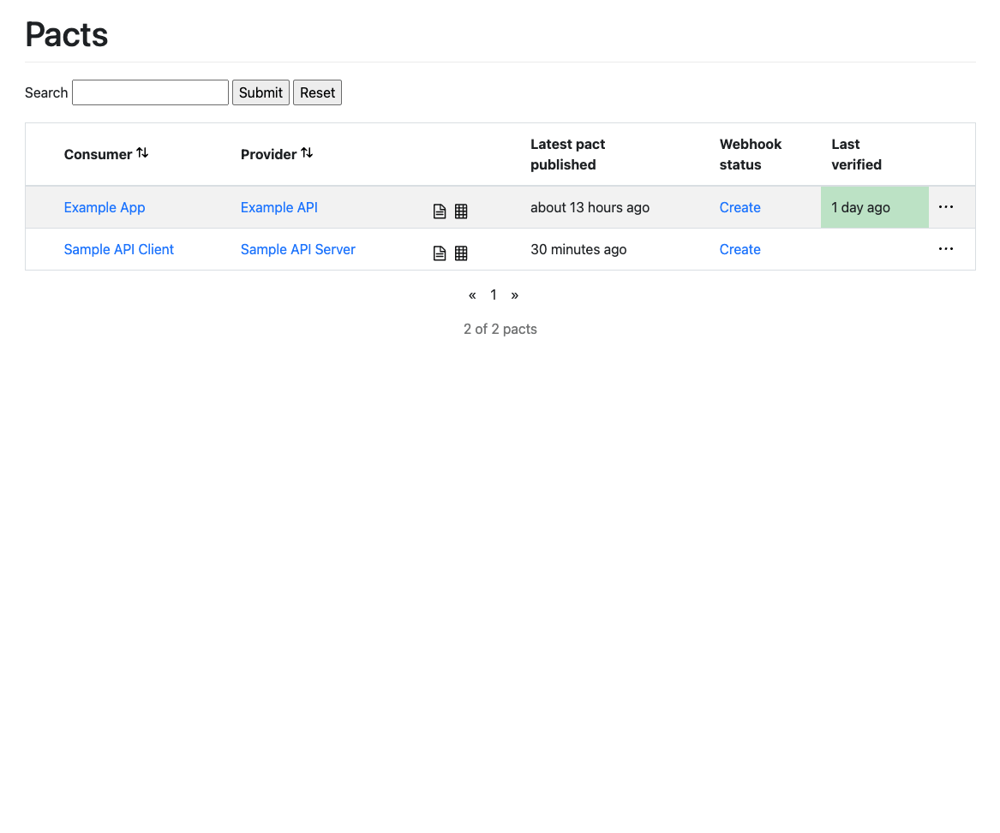

[](https://github.com/rogervinas/contract-testing-with-pact/actions/workflows/ci.yml)

# Contract Testing with Pact

This PoC shows a step by step implementation of contract testing using [Pact](https://docs.pact.io/).

First of all a couple of definitions:

> **[Contract testing](https://docs.pact.io/#what-is-contract-testing)** is a technique for testing an integration point by checking each application in isolation to ensure the messages it sends or receives conform to a shared understanding that is documented in a "contract".
> 
> **[Consumer driven contract testing](https://pactflow.io/what-is-consumer-driven-contract-testing/)** is a type of **contract testing** that ensures that a provider is compatible with the expectations that the consumer has of it. For an HTTP API (and other synchronous protocols), this would involve checking that the provider accepts the expected requests, and that it returns the expected responses. For a system that uses message queues, this would involve checking that the provider generates the expected message.

So let's try to implement this flow:


* [1) Consumer defines the "contract" with the Provider](#1-consumer-defines-the-contract-with-the-provider)
* [2) Consumer tests the "contract" using a provider mock](#2-consumer-tests-the-contract-using-a-provider-mock)
* [3) Consumer publishes the "contract"](#3-consumer-publishes-the-contract)
* [4) Provider tests the "contract" using a consumer mock](#4-provider-tests-the-contract-using-a-consumer-mock)
* [5) Provider verifies or refutes the "contract" publishing the results of the test](#5-provider-verifies-or-refutes-the-contract-publishing-the-results-of-the-test)
* [6) + 7) Consumer/Provider should only be deployed if the "contract" is verified](#6--7-consumerprovider-should-only-be-deployed-if-the-contract-is-verified)
* [Implementation Details](#implementation-details)

## 1) Consumer defines the "contract" with the Provider

For the "Sample API Client" we will use [Kotlin](https://kotlinlang.org/) and [Ktor client](https://ktor.io/docs/create-client.html).

To define the `POST /thing` endpoint we specify the following "pact":

```kotlin
@ExtendWith(PactConsumerTestExt::class)
@TestInstance(PER_CLASS)
class SampleApiClientContractTest {
  @Pact(provider = "Sample API Server", consumer = "Sample API Client")
  fun create(builder: PactDslWithProvider): V4Pact {
    return builder
      .given("Initial State")
      .uponReceiving("Create Thing")
      .path("/thing")
      .method("POST")
      .headers(mapOf("Content-Type" to "application/json"))
      .body(
        """
        {
          "name": "Foo",
          "value": 123.45,
          "date": "2022-10-13"
        }
        """.trimIndent()
      )
      .willRespondWith()
      .status(201)
      .headers(mapOf("Content-Type" to "application/json"))
      .body(
        """
        {
          "id": 123
        }
        """.trimIndent()
      )
      .toPact(V4Pact::class.java)
  }
}
```

For simplicity we use fixed JSON expectations but in a real example you may use [PactDslJsonBody DSL](https://docs.pact.io/implementation_guides/jvm/consumer#building-json-bodies-with-pactdsljsonbody-dsl) which allows to specify regex and type matchers to each field:

For example the request can be specified as:
```kotlin 
  .body(PactDslJsonBody()
    .stringMatcher("name", "\\w+", "Foo")
    .decimalType("value", 123.45)
    .localDate("date", "yyyy-MM-dd", LocalDate.of(2022, 10, 13))
  )
```

And the response:
```kotlin
  .body(PactDslJsonBody()
    .integerType("id", 123)
  )
```

To define the  `GET /thing/{id}` endpoint we will specify two "pacts":

* One for the case "thing exists":
```kotlin
@Pact(provider = "Sample API Server", consumer = "Sample API Client")
fun getExistingThing(builder: PactDslWithProvider): V4Pact {
return builder
  .given("Thing 123 exists")
  .uponReceiving("Get Thing 123 when it exists")
  .path("/thing/123")
  .method("GET")
  .willRespondWith()
  .status(200)
  .headers(mapOf("Content-Type" to "application/json"))
  .body(
    """
      {
        "name": "Foo",
        "value": 123.45,
        "date": "2022-10-13"
      }
      """.trimIndent()
  )
  .toPact(V4Pact::class.java)
}
```

* Another one for the case "thing does not exist":
```kotlin
@Pact(provider = "Sample API Server", consumer = "Sample API Client")
fun getNonExistingThing(builder: PactDslWithProvider): V4Pact {
return builder
  .given("Initial State")
  .uponReceiving("Get Thing 123 when it does not exist")
  .path("/thing/123")
  .method("GET")
  .willRespondWith()
  .status(404)
  .toPact(V4Pact::class.java)
}
```

## 2) Consumer tests the "contract" using a provider mock

Now we create tests for the three pacts defined in the previous step:

```kotlin
@Test
@PactTestFor(providerName = "Sample API Server", pactMethod = "create", providerType = SYNCH)
fun `should create thing`(mockServer: MockServer) {
  val client = SampleApiKtorClient(mockServer.getUrl())
  val thingId = runBlocking {
    client.create(SampleThing("Foo", 123.45, LocalDate.of(2022, 10, 13)))
  }
  assertThat(thingId)
    .isEqualTo(SampleThingId(123))
}

@Test
@PactTestFor(providerName = "Sample API Server", pactMethod = "getExistingThing", providerType = SYNCH)
fun `should get thing 123 when it exists`(mockServer: MockServer) {
  val client = SampleApiKtorClient(mockServer.getUrl())
  val thing = runBlocking { 
    client.get(SampleThingId(123)) 
  }
  assertThat(thing)
    .isEqualTo(SampleThing("Foo", 123.45, LocalDate.of(2022, 10, 13)))
}

@Test
@PactTestFor(providerName = "Sample API Server", pactMethod = "getNonExistingThing", providerType = SYNCH)
fun `should not get thing 123 when it does not exist`(mockServer: MockServer) { 
  val client = SampleApiKtorClient(mockServer.getUrl())
  val thing = runBlocking {
    client.get(SampleThingId(123))
  }
  assertThat(thing).isNull()
}
```

Note that:
* `pactMethod` should match the name of the method annotated with `@Pact`.
* Just for documentation, we specify the provider as a synchronous provider (HTTP)

If now we execute tests on `SampleApiClientContractTest`:
1. Tests will be executed against a provider mock.
2. The "contract" will be generated locally under `build/pacts`. We can generate them in another directory using `@PactDirectory` annotation or `pact.rootDir` system property.

You can check the "contract" in `build/pacts/Sample API Client-Sample API Server.json` file.

TODO implement the client!

## 3) Consumer publishes the "contract"

The consumer "contract" is now generated locally, but it should be published to a [Pact Broker](https://docs.pact.io/pact_broker), so it can be shared with the provider.

To test it locally:

1. Start a local instance of [Pact Broker](https://docs.pact.io/pact_broker) with a sqlite database:
```shell
docker compose up -d
```

2. Go to http://localhost:9292, we will see a "contract" example that comes by default:


3. Publish our consumer "contract" using pact gradle plugin:
```shell
cd ./sample-api-client
./gradlew pactPublish

> Task :pactPublish
Publishing 'Sample API Client-Sample API Server.json' ... 
OK
```

4. Go back to http://localhost:9292, we will see our consumer "contract":


## 4) Provider tests the "contract" using a consumer mock

Here we have two options to test the "contract":
* Test it against **only the API layer** using a [WebFluxTest](https://docs.spring.io/spring-boot/docs/current/reference/htmlsingle/#features.testing.spring-boot-applications.spring-webflux-tests).
* Test it against **the whole Application** using a [SpringBootTest](https://docs.spring.io/spring-boot/docs/current/reference/htmlsingle/#features.testing).

### Using WebFluxTest

We start with this:
```kotlin
@WebFluxTest(controllers = [SampleApiController::class])
@Provider("Sample API Server")
@PactFolder("../sample-api-client/build/pacts")
@ExtendWith(PactVerificationSpringProvider::class)
class SampleApiControllerContractTest {

  @Autowired
  private lateinit var webTestClient: WebTestClient

  @BeforeEach
  fun beforeEach(context: PactVerificationContext) {
    context.target = WebTestClientTarget(webTestClient)
  }

  @TestTemplate
  fun pactVerificationTestTemplate(context: PactVerificationContext) {
    context.verifyInteraction()
  }
  
  @State("Initial State")
  fun `initial state`() {
  }

  @State("Thing 123 exists")
  fun `thing 123 exists`() {
  }  
}
```
* `WebFluxTest` is a standard Spring Boot "slice test" where **only** those components needed to test `SampleApiController` will be started.
* A `WebTestClient` is the standard way to test controllers on a `WebFluxTest`, but in this case we will not use it directly, we will just pass it to the `PactVerificationContext` for it to use.
* In this first step we will read the "contract" from the local directory where `sample-api-client` has generated it, so we use `PactFolder` annotation.
* We use `Provider` annotation to specify that we are executing tests for the "Sample API Server" provider.
* We have to provide as many methods annotated with `State` as states the "contract" expects. We leave them empty for now but we will have to properly set the state there. 
* Finally `PactVerificationSpringProvider` junit5 extension and `pactVerificationTestTemplate` method annotated with junit5's `TestTemplate` will create tests dynamically following the "contract".

If we create an empty `SampleAPiController` to make this test compile:
```kotlin
@RestController
class SampleApiController
```

And then we try to execute the test:
```shell
cd sample-api-server
./gradlew test

> Task :test

SampleApiControllerContractTest > Sample API Client - Create Thing - FAILED
1) Verifying a pact between Sample API Client and Sample API Server - Create Thing: has status code 201
  1.1) status: expected status of 201 but was 404
  1.2) body: $ Actual map is missing the following keys: id

SampleApiControllerContractTest > Sample API Client - Get Thing 123 when it does not exist - PASSED

SampleApiControllerContractTest > Sample API Client - Get Thing 123 when it exists - FAILED
1) Verifying a pact between Sample API Client and Sample API Server - Get Thing 123 when it exists: has status code 200
  1.1) status: expected status of 200 but was 404
  1.2) body: $ Actual map is missing the following keys: date, name, value
```

So it turns out that with an empty controller we pass one of the tests 😜

If we end up with this final implementation for the controller ...
```kotlin
@RestController
class SampleApiController(private val repository: SampleRepository) {

  @PostMapping("/thing", consumes = [APPLICATION_JSON_VALUE], produces = [APPLICATION_JSON_VALUE])
  @ResponseStatus(CREATED)
  suspend fun create(@RequestBody thing: SampleThing) = repository.save(thing)

  @GetMapping("/thing/{id}", produces = [APPLICATION_JSON_VALUE])
  suspend fun get(@PathVariable("id") id: Int): ResponseEntity<SampleThing> {
    return when (val thing = repository.get(SampleThingId(id))) {
      null -> ResponseEntity.notFound().build()
      else -> ResponseEntity.ok(thing)
    }
  }
}
```

... then we can implement the contract test as:
```kotlin
@WebFluxTest(controllers = [SampleApiController::class])
@Provider("Sample API Server")
@PactFolder("../sample-api-client/build/pacts")
@ExtendWith(PactVerificationSpringProvider::class)
class SampleApiControllerContractTest {

  @Autowired
  private lateinit var webTestClient: WebTestClient

  @MockkBean
  private lateinit var repository: SampleRepository

  @BeforeEach
  fun beforeEach(context: PactVerificationContext) {
    context.target = WebTestClientTarget(webTestClient)
  }

  @TestTemplate
  fun pactVerificationTestTemplate(context: PactVerificationContext) {
    context.verifyInteraction()
  }

  @State("Initial State")
  fun `initial state`() {
    every { repository.save(any()) } returns SampleThingId(123)
    every { repository.get(any()) } returns null
  }

  @State("Thing 123 exists")
  fun `thing 123 exists`() {
    every { repository.get(SampleThingId(123)) } returns SampleThing("Foo", 123.45, LocalDate.of(2022, 10, 13))
  }
}
```
* We mock a `SampleRepository` because `SampleApiController` needs one.
* In the state "Initial State":
  * `SampleRepository` mock will return `null` whenever `get` is called with any `SampleThingId` because the repository is supposed to be empty.
  * `SampleRepository` mock will return `SampleThingId(123)` whenever `save` is called with any `SampleThing` to simulate saving it.
* In the state "Thing 123 exists":
  * `SampleRepository` mock will return `null` whenever `get` is called with any `SampleThingId` because the repository is supposed to be empty.

Now if we execute the test everything should be 🟩

Finally, in a real scenario we will use `PactBroker` instead of `PactFolder` in order to retrieve the "contract" from a PactBroker.
```kotlin
@WebFluxTest(controllers = [SampleApiController::class])
@Provider("Sample API Server")
@PactBroker
@ExtendWith(PactVerificationSpringProvider::class)
class SampleApiControllerContractTest {
   // ... 
}
```
* PactBroker url can be set directly on the `@PactBroker(url=xxx)` annotation or via the `pactbroker.url` system property. 

You can review the final implementation in [SampleApiControllerContractTest](sample-api-server/src/test/kotlin/com/rogervinas/sample/api/server/SampleApiControllerContractTest.kt).

### Using SpringBootTest

We can also test the "contract" against the whole application using a SpringBootTest:
```kotlin
@SpringBootTest(webEnvironment = DEFINED_PORT)
@Provider("Sample API Server")
@PactBroker
@ExtendWith(PactVerificationSpringProvider::class)
class SampleApiServerContractTest {

  @TestTemplate
  fun pactVerificationTestTemplate(context: PactVerificationContext) {
    context.verifyInteraction()
  }

  @State("Initial State")
  fun `initial state`() {
    // TODO set "Initial State" state
  }

  @State("Thing 123 exists")
  fun `thing 123 exists`() {
    // TODO set "Thing 123 exists" state
  }
}
```

If we want to start the application using a random port:
```kotlin
@SpringBootTest(webEnvironment = RANDOM_PORT)
@Provider("Sample API Server")
@PactBroker
@ExtendWith(PactVerificationSpringProvider::class)
class SampleApiServerContractTest {

  @LocalServerPort
  private var port = 0

  @BeforeEach
  fun beforeEach(context: PactVerificationContext) {
    context.target = HttpTestTarget("localhost", port)
  }

  // ...
}
```

Finally, we only need to set the expected state using the `@State` annotated methods. How we do that will be different on each case. For example if we are using a real database that would mean to insert/delete rows from a table, ...

Just for this PoC we can cheat a little and implement our in-mem `SampleRepository` this way with a convenient `reset` method:
```kotlin
@Repository
class SampleRepository {

  private val sampleThingIdNext = AtomicInteger(1)
  private val sampleThings = mutableMapOf<SampleThingId, SampleThing>()

  fun save(thing: SampleThing): SampleThingId {
    val thingId = SampleThingId(sampleThingIdNext.getAndIncrement())
    sampleThings[thingId] = thing
    return thingId
  }

  fun get(thingId: SampleThingId) = sampleThings[thingId]

  fun reset(nextId: Int) {
    sampleThingIdNext.set(nextId)
    sampleThings.clear()
  }
}
```

So we can implement the state methods this way:
```kotlin
  @Autowired
private lateinit var repository: SampleRepository

@State("Initial State")
fun `initial state`() {
  repository.reset(123) // clear repository and set next id = 123
}

@State("Thing 123 exists")
fun `thing 123 exists`() {
  repository.reset(123) // clear repository and set next id = 123
  repository.save(SampleThing("Foo", 123.45, LocalDate.of(2022, 10, 13))) // save a thing that will get id = 123
}
```

You can review the final implementation in [SampleApiServerContractTest](sample-api-server/src/test/kotlin/com/rogervinas/sample/api/server/SampleApiServerContractTest.kt).

## 5) Provider verifies or refutes the "contract" publishing the results of the test

To publish the result of the contract tests automatically to a PactBroker we need to:
* Use `@PactBroker` annotation.
* Set PactBroker url directly on `@PactBroker(url=xxx)` annotation or via `pactbroker.url` system property.
* Set system property `pact.verifier.publishResults=true`.
* Set system property `pact.provider.version` (we can use same version as our gradle project).

To test it locally:

1. Start a local instance of [Pact Broker](https://docs.pact.io/pact_broker) with a sqlite database:
```shell
docker compose up -d
```

2. Publish our consumer "contract" using pact gradle plugin:
```shell
cd ./sample-api-client
./gradlew pactPublish
```

3. Modify one of the provider tests, so it fails, for example comment this line on the [SampleApiControllerContractTest](sample-api-server/src/test/kotlin/com/rogervinas/sample/api/server/SampleApiControllerContractTest.kt):
```kotlin
@State("Thing 123 exists")
fun `thing 123 exists`() {
  // every { repository.get(SampleThingId(123)) } returns SampleThing("Foo", 123.45, LocalDate.of(2022, 10, 13))
}
```

4. Execute provider [SampleApiControllerContractTest](sample-api-server/src/test/kotlin/com/rogervinas/sample/api/server/SampleApiControllerContractTest.kt) (from IDE or command line):
```shell
cd ./sample-api-server
./gradlew test --tests '*SampleApiControllerContractTest'
```

5. Go to http://localhost:9292, and we will see our contract **not verified** (in red):


6. Fix the provider test and execute it again.

7. Go back to http://localhost:9292 and see not our contract **verified** (in green):


## 6) + 7) Consumer/Provider should only be deployed if the "contract" is verified

Both for the consumer and the provider we can execute `canIDeploy` gradle task will check if the "contract" has been verified in PactBroker, failing if not:

* No contract published ❌
```shell
./gradlew canIDeploy

> Task :canIDeploy FAILED
Computer says no ¯\_(ツ)_/¯ Request to path '/matrix/...' failed with response 400
```

* Provider has neither verified nor refuted the contract ❌
```shell
./gradlew canIDeploy 

> Task :canIDeploy FAILED
Computer says no ¯\_(ツ)_/¯

There is no verified pact between version 1.0 of Sample API Client and the latest version of Sample API Server (no such version exists)
```

* Provider has refuted the contract ❌
```shell
./gradlew canIDeploy

> Task :canIDeploy FAILED
Computer says no ¯\_(ツ)_/¯

The verification for the pact between version 1.0 of Sample API Client and the latest version of Sample API Server (1.0) failed
```

* Provider has verified the contract ✅
```shell
./gradlew canIDeploy

> Task :canIDeploy
Computer says yes \o/ 

All required verification results are published and successful
```

## Implementation Details

* TODO Pact gradle plugin id("au.com.dius.pact") version "4.3.15"
  * TODO properties set for the consumer
  * TODO properties set for the provider
* TODO Pact dependencies for the consumer au.com.dius.pact.consumer:junit5:4.3.15
* TODO Pact dependencies for the provider au.com.dius.pact.provider:junit5spring:4.3.15